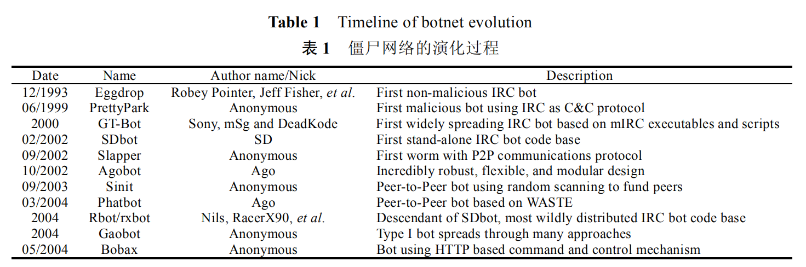
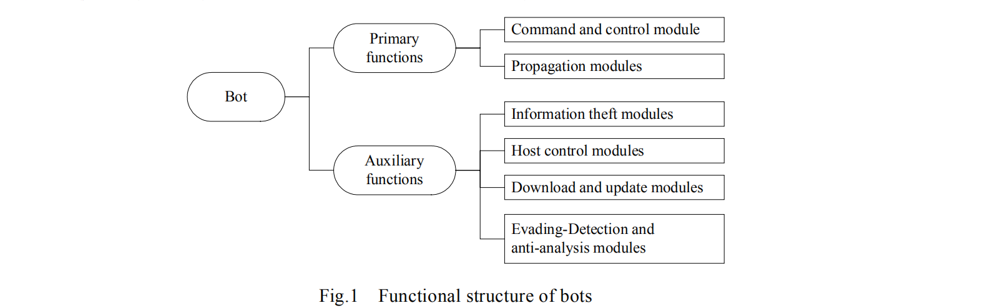
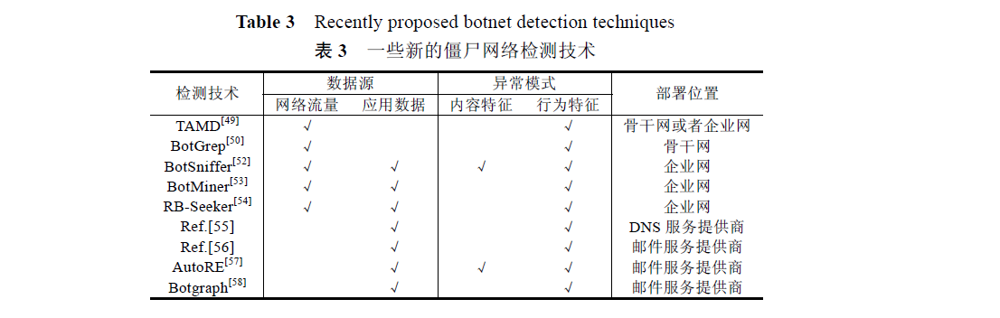

# 僵尸网络

## 基础概况

截止2007（僵尸网络研究）

僵尸网络(botnet)是攻击者出于恶意目的,传播僵尸程序控制大量主机,并通过一对多的命令与控制信道所
组成的网络.僵尸网络是从传统恶意代码形态包括计算机病毒、网络蠕虫、特洛伊木马和后门工具的基础上进
化,并通过相互融合发展而成的目前最为复杂的攻击方式之一.

### 定义、功能、工作机制

#### 定义

僵尸网络是可被攻击者远程控制的被攻陷主机所组成的网络。僵尸网络是攻击者(称为 botmaster)出于恶意目的,传播僵尸程序控制大量主机,并通过一对多的命令与控制信道所组成的网络.僵尸网络区别于其他攻击方式的基本特性是使用一对多的命令与控制机制.

#### 演化过程

（命令与控制信道）基于IRC，基于HTTP，基于P2P

包括蠕虫主动传播技术、邮件病毒传播技术、Rootkit 隐藏技术、多态变形及对抗分析技术等

#### 功能结构

僵尸网络控制器和僵尸程序

HTTP 僵尸网络与 IRC 僵尸网络的功能结构相似,所不同的仅仅是 HTTP 僵尸网络控制器是以 Web 网站方
式构建.而相应地,僵尸程序中的命令与控制模块通过 HTTP 协议向控制器注册并获取控制命令.

由于 P2P 网络本身具有的对等节点特性,在 P2P 僵尸网络中也不存在只充当服务器角色的僵尸网络控制
器,而是由 P2P 僵尸程序同时承担客户端和服务器的双重角色.P2P 僵尸程序与传统僵尸程序的差异在于其核
心模块——命令与控制模块的实现机制不同,如 Phatbot 僵尸程序是在基于 IRC 协议构建命令与控制信道的
Agobot 基础上,通过采用 AOL 的开源 P2P 协议 WASTE 重新实现其命令与控制模块,从而可以构建更难跟踪和
反制的 P2P 僵尸网络.

#### 工作机制

IRC 僵尸网络的工作机制如图 2 所示[14]:① 攻击者通过各种传播方式使得目标主机感染僵尸程序;② 僵
尸程序以特定格式随机产生的用户名和昵称尝试加入指定的 IRC 命令与控制服务器;③ 攻击者普遍使用动态
域名服务将僵尸程序连接的域名映射到其所控制的多台 IRC 服务器上,从而避免由于单一服务器被摧毁后导
致整个僵尸网络瘫痪的情况;④ 僵尸程序加入到攻击者私有的 IRC 命令与控制信道中;⑤ 加入信道的大量僵
尸程序监听控制指令;⑥ 攻击者登陆并加入到 IRC 命令与控制信道中,通过认证后,向僵尸网络发出信息窃取、
僵尸主机控制和攻击指令;⑦ 僵尸程序接受指令,并调用对应模块执行指令,从而完成攻击者的攻击目标.

### 命令与控制机制

#### 基于IRC协议的

基于IRC协议,攻击者向受控僵尸程序发布命令的方法有 3种:设置频道主题(TOPIC)命令,当僵尸程序登录
到频道后立即接收并执行这条频道主题命令;使用频道或单个僵尸程序发送 PRIVMSG 消息,这种方法最为常
用,即通过 IRC 协议的群聊和私聊方式向频道内所有僵尸程序或指定僵尸程序发布命令;通过 NOTICE 消息发
送命令,这种方法在效果上等同于发送 PRIVMSG 消息,但在实际情况中并不常见.

#### 基于HTTP的

与 IRC 协议相比,使用HTTP 协议构建僵尸网络命令与控制机制的优势包括两方面:首先,由于 IRC 协议已经是僵尸网络主流控制协议,安全业界更加关注监测 IRC 通信以检测其中隐藏的僵尸网络活动,使用 HTTP 协议构建控制信道则可以让
僵尸网络控制流量淹没在大量的因特网 Web 通信中,从而使得基于 HTTP 协议的僵尸网络活动更难以被检测;
另外,大多数组织机构在网关上部署了防火墙,在很多情况下,防火墙过滤掉了非期望端口上的网络通信,IRC 协
议使用的端口通常也会被过滤,而使用 HTTP 协议构建控制信道一般都可以绕过防火墙

#### 基于P2P的

Wang 等人在文献[23]中提出了一种更加先进的混合型 P2P 僵尸网络命令与控制机制的设计框架,在此框
架中,僵尸程序被分为两类:拥有静态 IP 地址并从因特网可以访问的僵尸程序称为 servent bots,这类僵尸程序承
担客户端和服务器的双重角色;其他由于 IP 地址动态分配、私有 IP 或防火墙过滤等原因无法从因特网访问的
僵尸程序称为 client bots,每个节点的邻居节点列表中只包含 servent bots.僵尸网络控制者通过认证机制后,可
从网络中的任意节点注入其控制命令,当一个节点获取新的控制命令后,通过向其邻居节点转发,从而快速传递
到每个 servent bot,client bot 则从其邻居节点列表中的 servent bots 获取控制命令.

#### 效率与韧性

对于由 IRC 协议和 HTTP 协议构建的集中式命令与控制机制,僵尸网络控制点与每个受控僵尸主机均直接
连接,因此其最大直径为 2,注入控制命令的僵尸网络控制者连接节点与其他主机的距离均为 2,因此,集中式僵
尸网络的效率非常高.但如果僵尸网络控制点被防御者清除,就会导致僵尸网络被完全分解,因此,集中式僵尸
网络的韧性很弱

小世界模型僵尸网络虽然很容易构建,但其效率和韧性都比不上随机网络和类 Gnutella 类型,因此并不适合作为僵尸网络的命令与控制机制的实现方式;虽然随机网络方式构建的僵尸网络的效率和韧性都处于良好的水平,但类 Gnutella 方式构建的僵尸网络能够达到更高的效率和更好的韧性.虽然这种方式对于黑客而言较难构建,但已存在的类 Gnutella 方式的 P2P 网络为他们构建高效率且高鲁棒性的僵尸网络奠定了基础.

### 跟踪检测与防御

#### 跟踪

首先通过各种途径获取因特网上实际存在的僵尸网络命令与控制信道的相关信息,然后模拟成受控的僵尸程序加入僵尸网络中,从而对僵尸网络的内部活动进行观察和跟踪.

##### 基于未知协议逆向

自动化未知协议逆向分析技术，污点传播技术

##### 基于Infiltrator

模仿真正僵尸程序，加入僵尸网络

##### 基于sandbox

可控环境中运行僵尸程序，并对其通信内容进行审计

#### 检测

TCP扫描权重

**Strayer T, Walsh R, Livadas C, Lapsley D. Detecting botnets with tight command and control. In: Proc. of the 31st IEEE Conf. on Local Computer Networks (LCN’06). Tampa: IEEE Computer Society Press, 2006. 195−202.**

通过检查带宽使用、持续时间和数据包时序等网络流属性来识别 IRC 僵尸网络命令与控制通信的方法

则应用机器学习方法来对 IRC 僵尸网络通信流量进行检测，最好的贝叶斯网络分类器也仅达到了误报率为 10%~20%、漏报率 30%~40%间的平衡.这一研究工作表明,简单地将机器学习方法应用到僵尸网络检测并不能取得良好的效果,必须充分考虑僵尸网络控制机制的内在特性.

被动监听网络流量,通过开源的 ngrep 工具获取其中包含的 IRC 协议连接信息,然后用 n-gram 分析方法实现评分函数,通过对 IRC 昵称的异常评定,检测出内部网络中被 IRC 僵尸网络所感染的僵尸主机

不足之处:① Rishi 方法依赖于正则表达式来检测和评价一个僵尸程序昵称,但目前存在一些僵尸程序使用与 IRC 用户类似的昵称命名结构,从而导致 Rishi 无法有效检测,僵尸网络控制者也很容易修改僵尸程序昵称命名结构以绕过 Rishi 所定义的正则表达式;② 该方法只能用于对基于标准 IRC 协议僵尸网络的检测,无法应对基于 HTTP,P2P 协议和其他自定义协议的僵尸网络.

**Gu G, Porras P, Yegneswaran V, Fong M, Lee W. BotHunter: Detecting malware infection through IDS-driven dialog correlation. In: Proc. of the 16th USENIX Security Symp. (Security 2007). 2007. http://www.usenix.org/events/sec07/tech/gu.html**

Gu 等人采用 IDS 驱动的会话关联方法实现了能够检测僵尸程序感染的 BotHunter 系统[42].该系统基于证据链(evidence trail)关联思想,将僵尸程序感染过程视为一台内网主机与外网一台或多台主机间的信息交互序列,包括目标扫描、破解攻击、二进制代码注入与执行、命令与控制信道连接和对外扫描等步骤.BotHunter 系统底层采用 Snort 入侵检测系统的特征检测方法以及两个关注僵尸程序的异常检测插件 SLADE 和 SCADE,以对僵尸程序感染的各个步骤进行检测:SLADE 插件实现了对流入连接的有损性 n-gram 负载分析方法,通过对执行协议负载的字节分布异常检测出恶意代码攻击;SCADE 插件进行针对恶意代码的平行及垂直端口扫描分析,可以检测出流入连接和流出连接中的扫描事件.然后,BotHunter关联分析器将底层 IDS报告的流入扫描报警、破解攻击报警和外出控制信道报警、对外扫描报警等事件联系在一起,从而给出一个详细的包含所有相关事件的僵尸程序感染会话景.BotHunter 系统的优点在于首次提出了一个关联和刻画僵尸程序整个感染过程的实时分析系统,并通过实际测试 35 个最近的僵尸程序验证了其有效性.

由于目前 IRC 协议仍是僵尸网络的主流控制协议,所以,几乎所有的相关研究工作都是关注 IRC 僵尸网络控制信道的检测和刻画.基于 HTTP 协议和基于 P2P 协议的僵尸网络由于具有较强的个性化差异,目前还无法给出通用化的检测方法,但随着这两类僵尸网络近年来的不断发展,构建对这两类僵尸网络的有效检测方法将是一个重要的研究课题

#### 检测方向

**终端检测（检测恶意僵尸程序）**

**网络流量分析（**僵尸程序与控制服务器通信的流量数据具有时空相似性，）

**基于协议特征**

（IRC昵称相似性，Fast-flux中心控制服务器域名IP地址不断跨域，包含大量NS记录，与正常域名解析结果有较大差异，根据域名判定，检测面向的协议有限）

**基于增殖网络攻击**

溯源DDos攻击源地址，垃圾邮件源地址。僵尸网络发出的邮件

- 具有内容相似性
- 邮件账号注册异常，同一IP在短时间内注册大量账号
- 同一账户在短期内跨AS域发送邮件
- 垃圾邮件与合法邮件的流量模型也有差异

#### 不同阶段检测重点

**传播阶段**

僵尸网络有5种传播模式，包括攻击漏洞、电子邮件携带、恶意网站脚本、及时通信以及伪装软件。攻击漏洞不需要用户参与，可以自动完成。攻击漏洞过程中通常伴随着系列扫描行为。检测出这些非法的扫描行为，可以在一定程度上检测僵尸网络传播，但是这种扫描行为容易和其他形式的扫描行为混淆，不容易被检测到。

**感染阶段**

感染是把僵尸程序植入被攻陷主机的过程，导入恶意代码，修改windows注册表，关闭特定进程等。

僵尸程序在感染时会出现三个特征：

- 僵尸程序的启动是自动的
- 僵尸程序必须与攻击者建立命令与控制信道
- 僵尸程序迟早会执行本地或远程攻击

运行于主机端的恶意软件识别模块

**通信阶段**

IRC僵尸网络

- 典型的僵尸网络的命令与控制机制具有清晰的命令响应模式，无状态的僵尸程序在重复回话中的行为总是确定的
- 僵尸程序对接收到的一些列命令的响应行为都是提前编程好的

使用假设检验理论分辨出僵尸网络会话与人与人之间的会话

HTTP僵尸网络

http僵尸程序以规律性的时间间隔反复连接http服务器。

僵尸程序产生的网络流量具有时空相似性（BotSniffer）

P2P僵尸网络

特性

- 使用开放的连接端口，端口可能是一个区间
- NetFlow数据中失败连接的比率很大
- 使用一个稳定的IP地址列表进行点对点发现
- 有些P2P网络具有中心点

网络相关特性可以在协议流量、通过dns查询右键的交换记录，以及smtp连接等统计信息中体现

**攻击阶段**

见：基于增殖网络攻击

#### 通用检测框架（BotMiner）

僵尸网络的本质特征是僵尸程序与命令与控制服务器通信并执行恶意行为，这一切都是以相关的方式发生的。可以对相似的通信和恶意流量进行聚类，利用交叉关联的思想识别出具有相似通信和恶意行为模式的主机

### 防御反制

僵尸网络的防御与反制存在两种不同的方法:由于构建僵尸网络的僵尸程序仍是恶意代码的一种,因此,传统的防御方法是通过加强因特网主机的安全防御等级以防止被僵尸程序感染,并通过及时更新反病毒软件特征库清除主机中的僵尸程序.Overton 等人给出了防御僵尸程序感染的方法[43],包括遵循基本的安全策略以及使用防火墙、DNS 阻断、补丁管理等技术手段.另一种防御方法是针对僵尸网络具有命令与控制信道这一基本特性,通过摧毁或无效化僵尸网络命令与控制机制,使其无法对因特网造成危害.由于命令与控制信道是僵尸网络得以生存和发挥攻击能力的基础,因此,第 2 种防御方法比第 1 种更加有效.

### 对抗

- 僵尸网络劫持（向僵尸网络注入良性控制命令）
- 僵尸程序漏洞攻击
- 索引污染攻击（针对使用DHT的P2P僵尸网络），sybil攻击
- 关键节点拒绝服务攻击

## 僵尸网络检测的核心问题

### 多源信息采集与融合

僵尸网络具有隐秘性，其踪迹往往隐藏在各种信息之中，分散在不同层次（个人主机、区域网、骨干网）不同类型的网络设备，以不同的格式进行存储，多源信息又包含各种冗余，不确定信息，都会对检测结果产生影响。

### 僵尸网络内在特性提取

#### 使用蜜罐

针对蜜罐或蜜网捕获的僵尸网络样本，由于样本数据比较纯净，提取出来的数据特性可以直接作为僵尸网络的内在特性

#### 针对通用信息

（网络数据流量，日志）首先要发现信息数据中的特性

### 通信检测

基于IRC，DNS这钟具有明显的集中式结构的控制协议，总是表现出比较强的相似、关联特性，检测效果明显。

基于HTTP，P2P协议的僵尸网络表现出较强的个体性质。

## 检测方法总结

**王新良. (2011). 僵尸网络异常流量分析与检测. *北京邮电大学硕士学位论文*.**

基于网络流量内容特征、基于网络流量行为特征、基于关联分析、基于应用数据和日志分析

